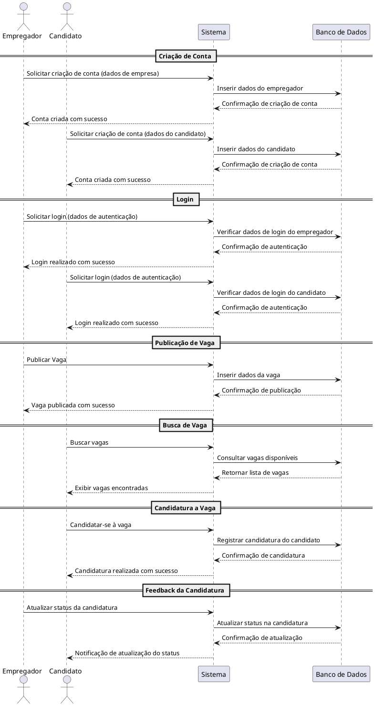
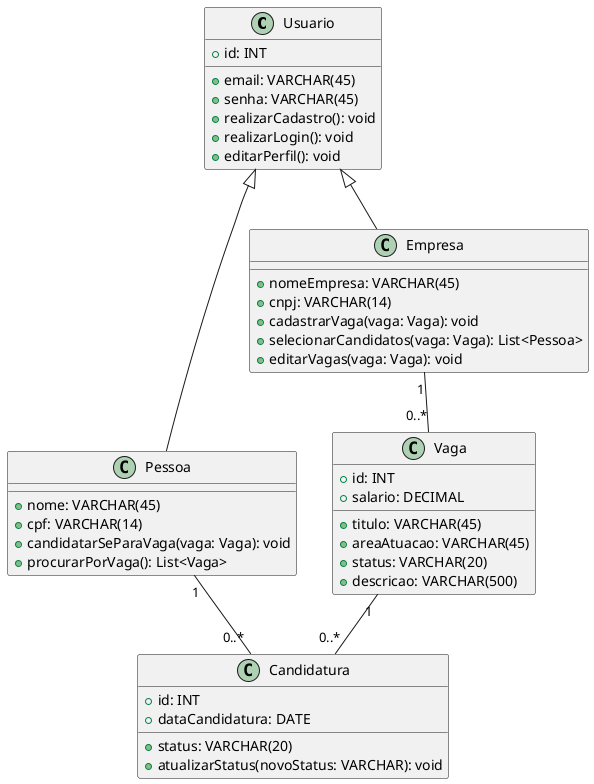
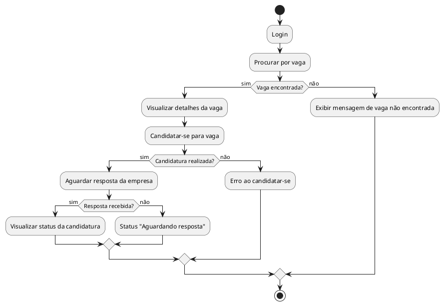
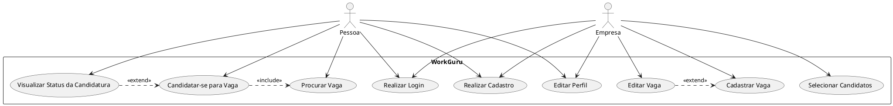
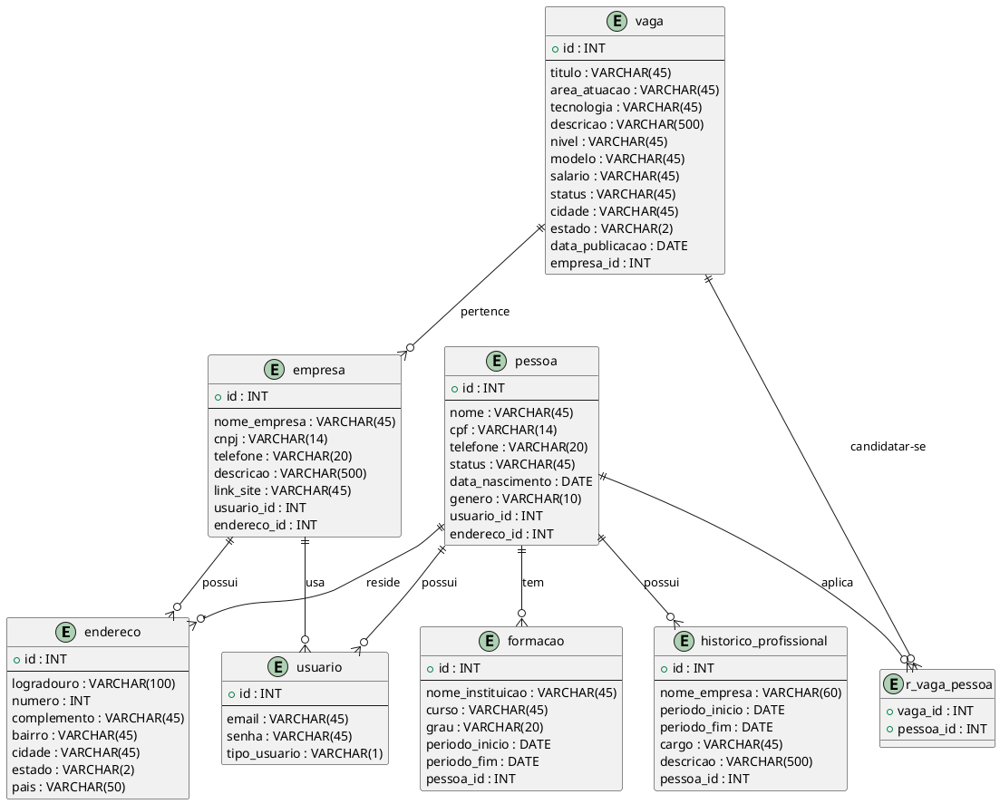

# Documentação UML
Este documento contém diagramas UML criados com PlantUML. Cada seção inclui o código fonte do diagrama em PlantUML e, em seguida, a imagem correspondente ao diagrama.

## Diagrama de Interação

## Diagrama de Classes

## Diagrama de Atividades

## Diagrama de Casos de Uso

## Diagrama Estrutural

